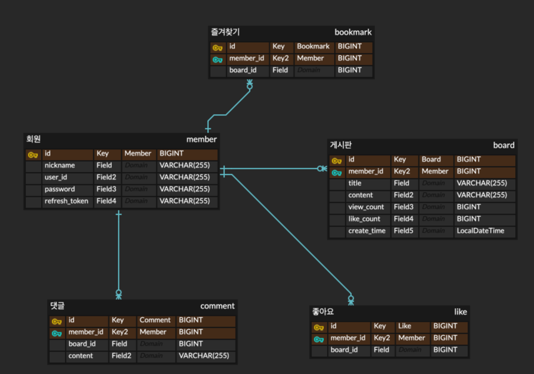

# Board

# 기능 요구사항
### 게시판
- 글 작성, 수정, 삭제, 조회
- 게시글 조회수 표시
- 글 목록 표시(페이징)
  - 제목, 생성일, 글 번호, 조회수 -> 4가지 카테고리로 페이징 가능
- 좋아요 기능
- 즐겨찾기 기능
### 댓글
- 작성, 수정, 삭제, 조회
### 회원
- 닉네임 변경
### 로그인 / 로그아웃
### 회원가입

# 예외 처리 방식
- Custom Exception

# TASK
1. 글 작성
2. 글 조회 
3. 글 삭제 
4. 글 수정   
5. 글 좋아요
6. 글 조회수
7. 글 페이징
8. 회원가입 
9. 로그인 / 로그아웃
10. 닉네임 변경
11. 댓글 생성
12. 댓글 조회
13. 댓글 수정
14. 댓글 삭제

# ERD
